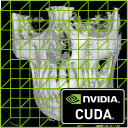

    
	 

# Dividing Cubes with  CUDA 

A sequentiel and parallel implementation of the [Dividing Cubes algorithm](https://doi.org/10.1118/1.596225) using C++ and CUDA.

## Abstract

3D image reconstruction has the potential to bring major advancements in science and medicine by allowing the visualization of inner living organs in their real states and forms.
Using modern modalities such as Computed Tomography (CT) and Magnetic Resonance Imaging (MRI), serial 2D images are produced and used in 3D reconstruction.
However, the reconstruction process is very slow and very expensive in terms of compute resources due to the massive quantity of data to process resulted from the acquisition task.
Meanwhile, Graphic Processing Unit (GPU), with its tremendous capability of parallel computing, becomes more and more popular in High Performance Computing.
In addition, CUDA, a parallel computing platform and programming model that was invented by NVIDIA, makes GPU programming much easier and faster.

In our research, we focused on the use of this power of parallel computing in order to accelerate the reconstruction process while trying to have the most accurate representation of the reconstructed object.

### Keyword

*3D Medical Imaging*, *Image Reconstruction*, *Dividing Cubes*, *GPU*, *CUDA*.

## Outputs

TODO

    
	 

TODO

    
	 

## Modules

### Data Reader Module

TODO

    
	 

### Squential (Non-Parallel) Module

TODO

    
	 

### CUDA (Parallel) Module

TODO

    
	 

### Visualization Module

TODO

    
	 

## Notes

- Running this code requires a CUDA capable GPU (compute capability 2.2)
- The datasets used in this project have all been obtained from [here](http://www.gris.uni-tuebingen.de/edu/areas/scivis/volren/datasets/datasets.html)

TODO

## Authors

- Mohamed Tahar KEDJOUR [@kjmx](https://github.com/KjmX)

- Anis LOUNIS [@anixpasbesoin](https://github.com/AnixPasBesoin)